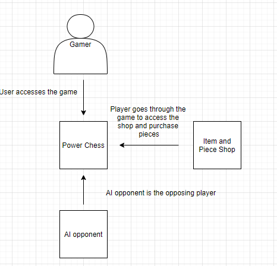
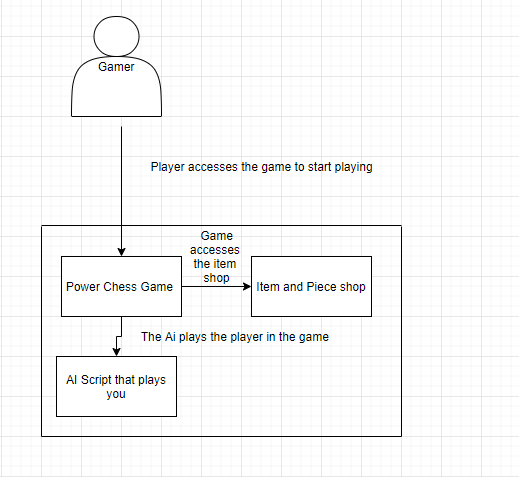
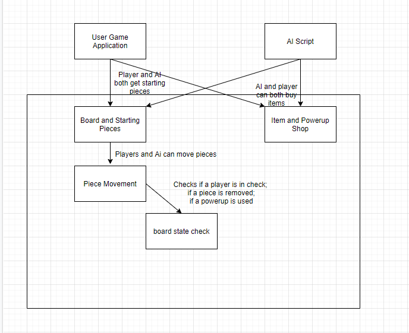
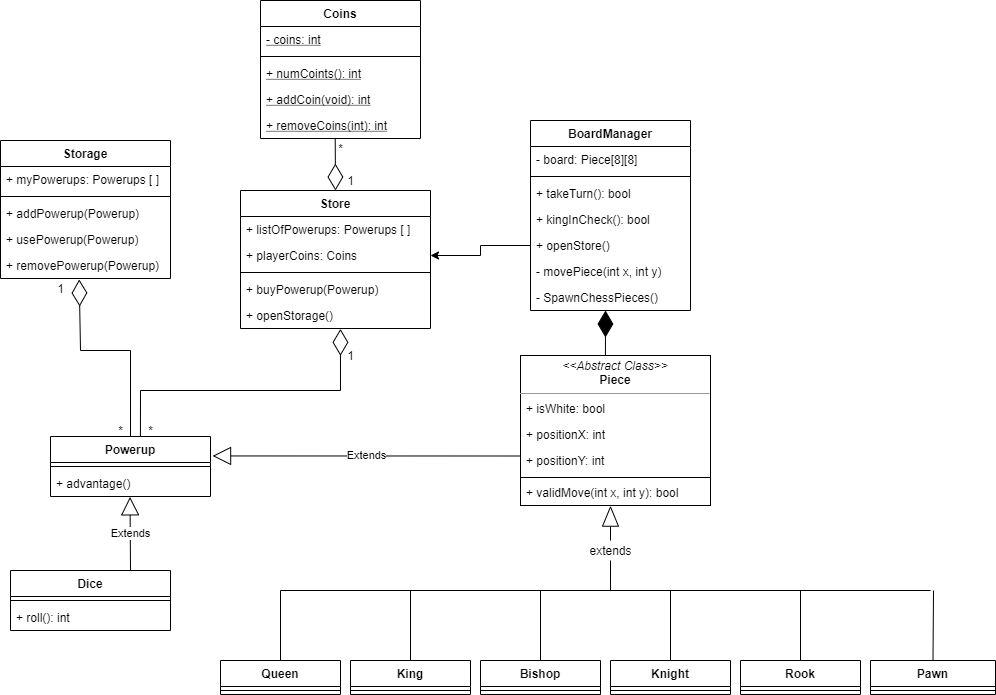
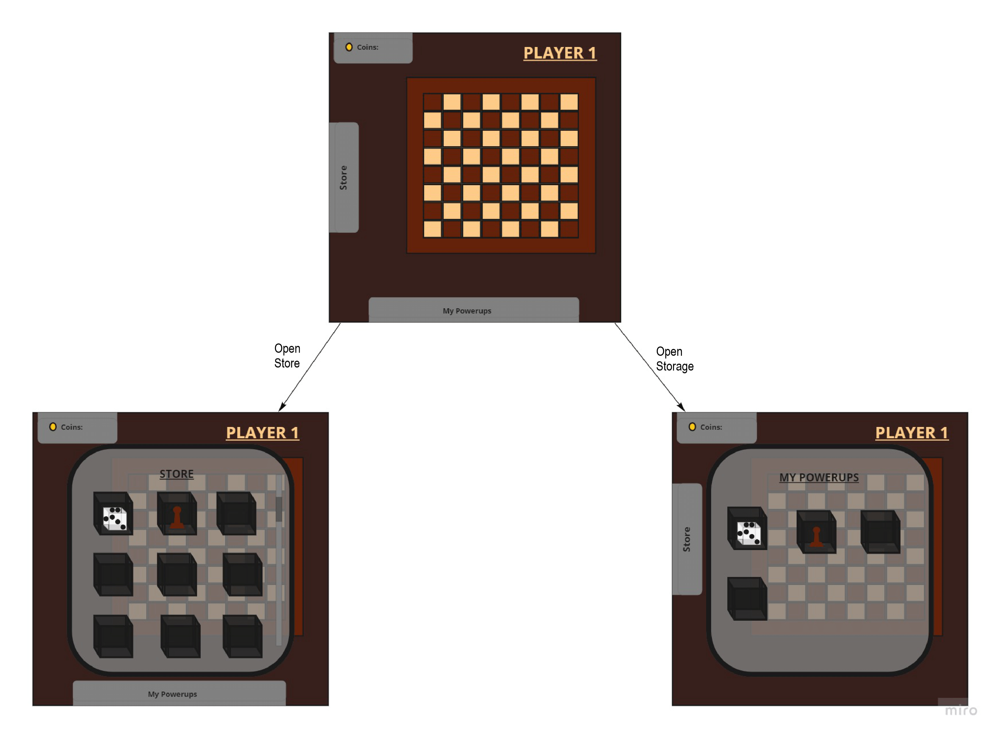

# Program Organization
### System context diagram

The game itself will require direct input from the user and access to the shop where the user can buy powerups. The user will play against an AI player.

### Container diagram

Again, the game will require direct input from the user and will then store data in the various classes respectively. The user is responsible for their own pieces and purchased powerups, and the store will keep a list of the available powerups.

### Component diagram

The game will be played against an AI that will use the same moves as the player and has the same resources. The user and AI will interact with the board by moving pieces and adding powerups. They will be able to buy powerups from the shop if they accrue enough coins. The board will update with each turn and will be checking for any moves that will end the game such as checkmate or stalemate.

| Architecture Component | User Story |
| ----- | ---------- |
| Power Chess Game | 000, 003, 009, 010, 012, 013, 015, 016, 017, 018 |
| Item and Piece Shop | 001, 002, 004, 005, 006, 009 |
| AI Opponent | 011, 014 |

# Code Design

Description of the major classes:

BoardManager: The board class is used to create an instance of a board and monitors the state of the game (whose turn it is and if the game is over). Since our current idea of the game does not have multiple instances of games running concurrently there is no need to have a higher level class track these attributes. The board class maintains a double dimension array of Piece instances and at least one instance of a store object.

BoardHighlights: This class manages highlighting the squares on the board where a certain piece can move legally.

Store: The store class generates a list of power-ups that can be purchased with coins and applied to the squares in a board. Each store creates a storage object to track purchased power-ups before they are applied.

Coins: The coins class exists to track the in-game economy. The class includes simple set and get methods.

PowerUp: The powerup class is used to generate advantages from a pre-generated range that will be used to populate the Store. Powerups can be stored in a storage object and applied to a square.

Piece: The Piece class is an abstract class from which the individual chess pieces will extend from. It tracks a piece's color and position. Since each piece moves differently, each chess piece will implement its own validMove() method.

| Class | User Story |
| ----- | ---------- |
| BoardManager | 000, 003, 009, 010, 012, 013, 015, 016, 017, 018 |
| BoardHighlights | 015 |
| Piece | 000, 003, 015 |
| Store | 002, 004, 005 |
| Coins | 001, 004, 009 |
| Storage | 006, 012 |
| Powerup | 002, 004, 006, 012 |

# Data Design

Our game does not require a database for storing information. Any data that needs to be collected on behalf of the user will be stored in the various classes that make up the program. A user's pieces and their location will be stored in Square and Board, they number of coins they have collected will be stored in Coins, the powerups they have purchased will be in Storage, etc. All data is stored in the form of arrays. At this moment we do not see a need for dynamic storage since there are strict bounds on the data being monitored. (A board is always 8 x 8, and there are a finite number of powerups to choose from). Our data is stored sequentially since data such as pieces and power-ups have a value associated with them. This makes storage and access easy.

# Business Rules

The constraints on our system and the users pertain mostly to the rules of the game. For example, the player cannot move a piece, buy a powerup, or deploy a powerup when it is not their turn; the player cannot buy a powerup without a sufficient amount of coins; and the player cannot move a piece to an invalid square.

# User Interface Design

The top diagram shows what a player will mainly see. Given it is a chess game, the chess board will be the main focus. The player will move the pieces on the board, as in a normal chess game, and they can click on the "Store" tab to the left or the "My Powerups" tab at the bottom to view available/purchased powerups. They can see how many coins they have gained in the top left corner.  The bottom left diagram gives an idea of what the store will look like. Here, the player can look at the various powerups they can buy.  The bottom right diagram shows a player's storage where the powerups they have purchased can be found.

| UI Component | User Story |
| ----- | ---------- |
| Board | 000, 003, 009, 010, 012, 015 |
| Piece | 000, 003 |
| Powerups | 004, 009, 012 |
| Store | 002, 004, 005 |
| Coin Tab | 001, 004, 009 |
| Storage | 004, 006, 012 |

# Resource Management

The game should not run out of resources in terms of memory given it is mainly tracking the chess board, the store and user's coins, and the user's storage. Also, we are not using a database.

# Security

Our system will not require a user account, profile, or password.

# Performance

Performance is not a concern in terms of resources or goals. Our most critical user stories can be implemented in time for a functional game with it's main features.

# Scalability

The game, once finished, will not grow anymore. Also, because we are not requiring user profiles or making use of a database, increased number of users should not be a concern.

# Interoperability

Our system will not require data or resources to be shared with any other software. The game will run entirely off of the Unity engine and will be self contained.

# Internationalization/Localization

Our software is not expect to be run internationally. As such the software will be written with English as the primary language and no language interface will be needed. Unicode will be used.

# Input/Output

Given we are creating a game, user input is one of the main components and will be processed just-in-time. Incorrect input from the user should not cause any issues and in the event they try to do something when it is not their turn, a warning message will pop up.

# Error Processing

We will process errors through detection and with the help of Unity. For the errors Unity does not handle, we will use exception handling and a message will pop up to the user as a warning. Errors that are detrimental to the program will shut it down and the user will have to reload the game.

# Fault Tolerance

If an error is detected, the system will revert back to how it was before the error occurred. For example, if a player puts a chess piece on a square that is not availabe or out of that piece's capability, it will go back to it's original location. Or, if a player tries to move something when it is not their turn, it will go back to its original location and an error message will give them a warning.

# Architectural Feasibility

The focus of our game is mainly on the chess board, the store, and powerup storage, which is nothing new and can all be feasibly implemented. We would like to have an AI component but in the even that becomes infeasible, we can keep it a 2-player multiplayer game.

# Overengineering

We will avoid overengineering by sticking to the user stories and keeping things simple. We will try to implement only necessary classes and keep functionality singular. The user only needs to focus on three core elements, being the chess board, the store, and their storage, which allows us to keep things simple and work on core functionality.

# Build-vs-Buy Decisions

We are using the Unity game engine and therefore utilizing the added functionality that comes with UnityEditor. Also, we will be importing most of our graphics from the Unity Assets store.

# Reuse

We will not be reusing preexisting software.

# Change Strategy

Our change strategy relies on communication, our user stories, and GitHub. We have classes concentrated on one thing so if change is needed in code in can be done without damage. Also, through clear communication with one another and Github's use of version control, adapting to any changes in the system should not be difficult. Changes made to our game will be clearly stated in our user stories.
