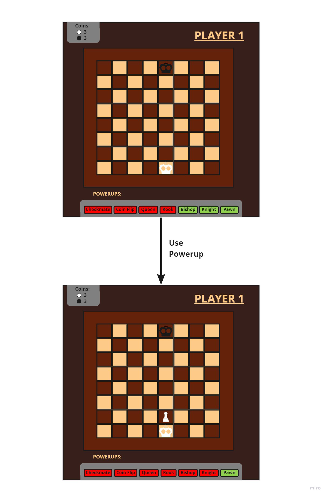

# Program Organization

# Code Design

| Class | User Story |
| ----- | ---------- |
| Board | 000, 003, 009, 010, 012 |
| Square | 000, 010 |
| Piece | 000, 003 |
| Store | 002, 004, 005 |
| Coins | 001, 004, 009 |
| Storage | 006, 012 |
| Powerup | 002, 004, 006 |
| Dice | 004, 012 |

# Data Design

Our game does not require a database for storing information. Any data that needs to be collected on behalf of the user will be stored in the various classes that make up the program. A user's pieces and their location will be stored in Square and Board, they number of coins they have collected will be stored in Coins, the powerups they have purchased will be in Storage, etc.

# Business Rules

# User Interface Design

The top diagram shows what a player will mainly see. Given it is a chess game, the chess board will be the main focus. The player will move the pieces on the board, as in a normal chess game, and they can click on the "Store" tab to the left or the "My Powerups" tab at the bottom to view available/purchased powerups. They can see how many coins they have gained in the top left corner.  The bottom left diagram gives an idea of what the store will look like. Here, the player can look at the various powerups they can buy.  The bottom right diagram shows a player's storage where the powerups they have purchased can be found.

# Resource Management

# Security

Our system will not require a user account, profile, or password.

# Performance

# Scalability

# Interoperability

# Internationalization/Localization

# Input/Output

# Error Processing

# Fault Tolerance

If an error is detected, the system will revert back to how it was before the error occurred. For example, if a player puts a chess piece on a square that is not availabe or out of that piece's capability, it will go back to it's original location. Or, if a player tries to move something when it is not their turn, it will go back to its original location and an error message will give them a warning.

# Architectural Feasibility

# Overengineering

# Build-vs-Buy Decisions

# Reuse

# Change Strategy
