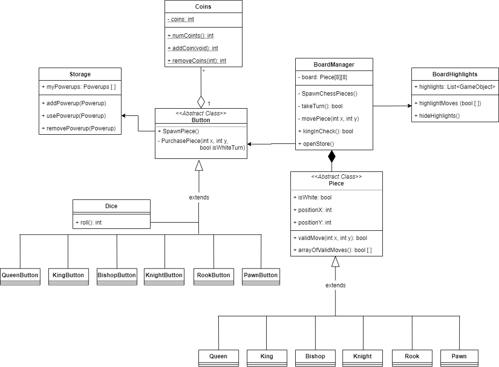

# Program Organization

# Code Design

# Data Design

| Class | User Story |
| ----- | ---------- |
| Board | 000, 003, 009, 010, 012 |
| Square | 000, 010 |
| Piece | 000, 003 |
| Store | 002, 004, 005 |
| Coins | 001, 004, 009 |
| Storage | 006, 012 |
| Powerup | 002, 004, 006 |
| Dice | 004, 012 |

# Business Rules

# User Interface Design

The top diagram shows what a player will mainly see. Given it is a chess game, the chess board will be the main focus. They can see how many coins they have gained in the top left corner.  The bottom left diagram gives an idea of what the store will look like. Here, the player can look at the various powerups they can buy.  The bottom right diagram shows a player's storage where the powerups they have purchased can be found.

# Resource Management

# Security

# Performance

# Scalability

# Interoperability

# Internationalization/Localization

# Input/Output

# Error Processing

# Fault Tolerance

# Architectural Feasibility

# Overengineering

# Build-vs-Buy Decisions

# Reuse

# Change Strategy
